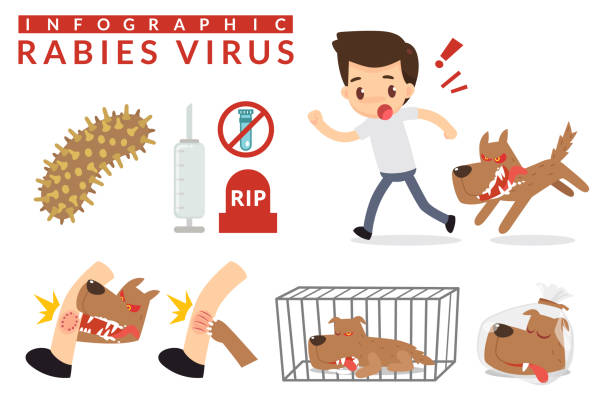
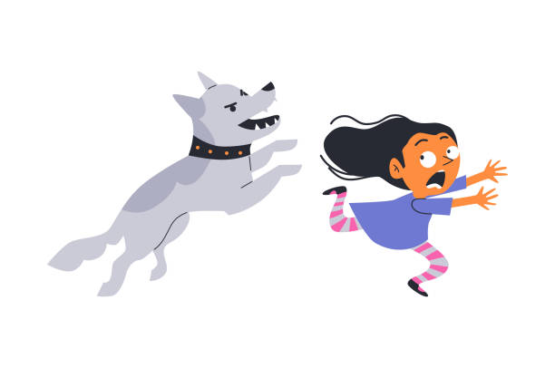
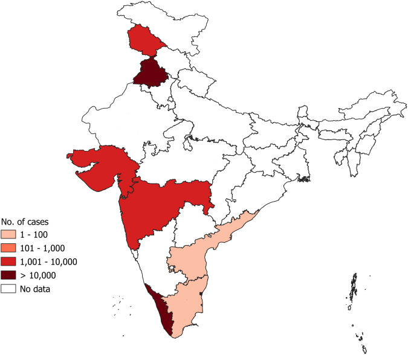
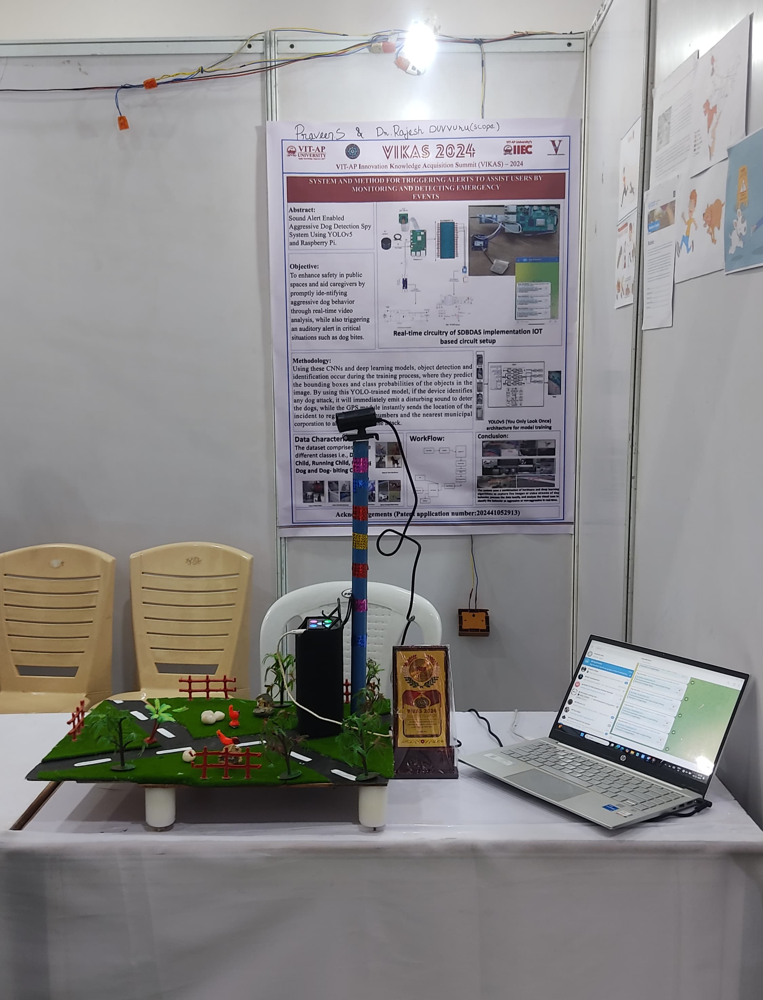
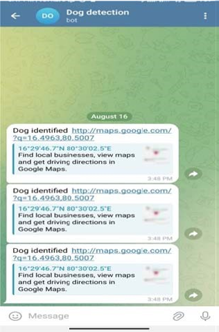

# 🐶 Dog-Attack-Detection-Spy-YOLOv5 

A Raspberry Pi-based dog attack detection system powered by **YOLOv5**.

This solution helps in **preventing dog attacks** by:
- Detecting approaching/aggressive dogs  
- **Triggering an alarm sound** to scare them away  
- **Sending the incident location** via SMS using a GPS module  

---

## 🚀 System Deployment

- 🧠 **Model**: YOLOv5 (custom-trained)  
- 📷 **Hardware**: Raspberry Pi 4 with Camera Module  
- 📡 **Sensors**: GPS Module for location tracking  
- 🔊 **Output**: Alarm + SMS alert to registered number  
- 🧰 **Code**: Written in Python, optimized for edge devices  

---

## 📸 Sample Detection Outputs

### 🐕 Dog Attack Detection

These images show examples of YOLOv5 identifying potential dog attack scenarios.

<table>
  <tr>
    <td></td>
    <td></td>
  </tr>
  <tr>
    <td></td>
    <td></td>
  </tr>
</table>

---

### 🧪 Prototype Setup & 📈 YOLOv5 Inference Output

<table>
  <tr>
    <td></td>
    <td></td>
  </tr>
</table>

---

## 🎥 Demo Video

[▶️ Click to watch demo video](https://github.com/praveensunkara19/Dog-Attack-Detection-Spy-YOLOv5/blob/main/images/yolo_video.mp4)

> ⚠️ GitHub does not support video autoplay. You can also [upload to YouTube](https://youtube.com) for a better viewing experience.

---

## 🔗 Features at a Glance

| Component     | Functionality                                 |
|---------------|-----------------------------------------------|
| YOLOv5        | Dog detection and classification              |
| Raspberry Pi  | Real-time inference and sensor integration    |
| GPS Module    | Fetching latitude and longitude               |
| Alarm Output  | Playing sound on detection                    |
| SMS Service   | Alerting a registered mobile number           |

---

# 🛠️ Installation & Usage

Follow the steps below to set up and run the Dog Attack Detection Streamlit app:

### 1️⃣ Clone the Repository

```bash
git clone https://github.com/praveensunkara19/Dog-Attack-Detection-Spy-YOLOv5.git

cd Dog-Attack-Detection-Spy-YOLOv5

2️⃣ Create and Activate a Virtual Environment (Recommended)
Create virtual environment (Windows):
```bash

python -m venv myenv
Activate virtual environment:

myenv\Scripts\activate
3️⃣ Install Required Dependencies
```bash

pip install -r requirements.txt
✅ Ensure you have Python 3.8+ installed.

4️⃣ Run the Streamlit App
```bash

streamlit run app.py

The app will open automatically in your browser. You can:

Upload images/videos for detection

Try the built-in test image/video

View side-by-side results of predictions

📦 Folder Structure

Dog-Attack-Detection-Spy-YOLOv5/
│
├── images/            # Sample image outputs + demo video  
│   ├── image1.jpg  
│   ├── image2.jpg  
│   ├── image3.jpg  
│   ├── image4.jpg  
│   ├── image5.jpg  
│   ├── image6.png  
│   └── yolo_video.mp4  
│
├── test/              # Test input files  
│   ├── testimg.jpg  
│   └── test_video.mp4  
│
├── yolov5_best.pt     # Trained YOLOv5 model  
├── app.py             # Streamlit app  
├── requirements.txt   # Dependencies  
├── README.md          # Project documentation  

📬 Contact
For issues, suggestions, or collaborations:
📧 Email Me: praveensunkara19@gmail.com
🔗 GitHub: praveensunkara19