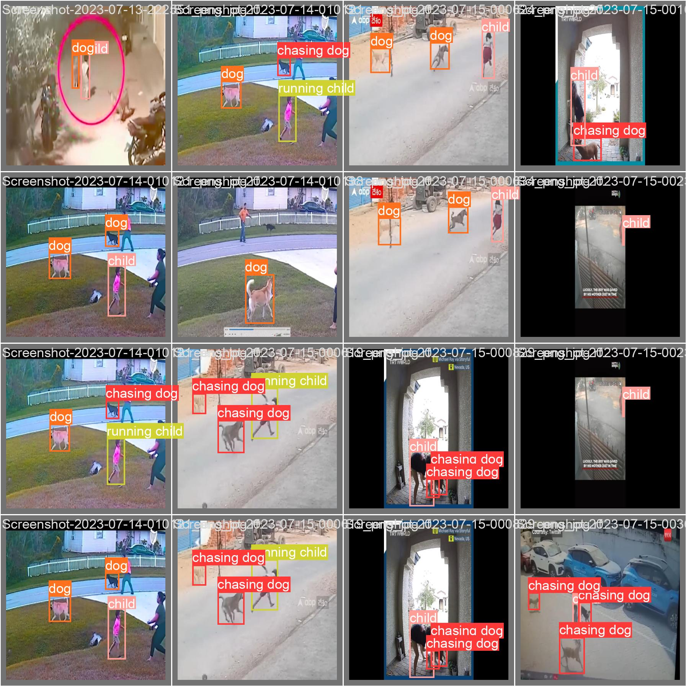

# 🐶 Dog Attack Detection Spy – YOLOv5

A **Raspberry Pi-based dog attack detection system** powered by YOLOv5.

This solution helps **prevent dog attacks** by:

- 🐕 **Detecting** approaching or aggressive dogs  
- 🚨 **Triggering an alarm** to scare them away  
- 📍 **Sending incident location** via SMS (Telegram bot) using a GPS module  

✅ **Supported by our patent!**

---

## 🚀 System Deployment

- 🧠 **Model:** YOLOv5 (custom-trained)  
- 📷 **Hardware:** Raspberry Pi 4 with Camera Module  
- 📡 **Sensors:** GPS Module for location tracking  
- 🔊 **Output:** Alarm sound + SMS alert to registered numbers  
- 🧰 **Code:** Python, optimized for edge devices

---

## 📸 Sample Detection Outputs

### 🐕 Real-World Dog Attack References

Dog attacks can cause severe injuries or death from rabies. The following images show real-world references:

<table>
  <tr>
    <td></td>
    <td></td>
  </tr>
  <tr>
    <td></td>
    <td></td>
  </tr>
</table>

---

### 🧪 Prototype Setup & YOLOv5 Inference

These images show YOLOv5 identifying potential dog attack scenarios and our physical prototype setup:

<table>
  <tr>
    <td></td>
    <td></td>
    <td></td>
  </tr>
</table>

---

## 🎥 Demo Video

[▶️ Watch Demo Video](https://github.com/praveensunkara19/Dog-Attack-Detection-Spy-YOLOv5/blob/main/images/yolo_video.mp4)

> ⚠️ GitHub does not support autoplay. For a better experience, watch on [YouTube](https://youtu.be/mKBjsPU-u8U).

---

## 🔗 Features at a Glance

| Component       | Functionality                          |
|-----------------|----------------------------------------|
| **YOLOv5**      | Dog detection and classification      |
| **Raspberry Pi**| Real-time inference and integration   |
| **GPS Module**  | Fetching latitude and longitude       |
| **Alarm Output**| Playing alarm sound on detection      |
| **SMS Service** | Sending alerts via Telegram bot       |

---

## 🛠️ Installation & Usage

Follow these steps to set up and run the Dog Attack Detection app:

```bash
# 1️⃣ Clone the Repository
git clone https://github.com/praveensunkara19/Dog-Attack-Detection-Spy-YOLOv5.git
cd Dog-Attack-Detection-Spy-YOLOv5

# 2️⃣ Create and Activate a Virtual Environment (Recommended)
# Windows
python -m venv myenv
myenv\Scripts\activate

# 3️⃣ Install Dependencies
pip install -r requirements.txt

# ✅ Ensure you have Python 3.8+ installed.

# 4️⃣ Run the Streamlit App
streamlit run app.py


The app will open automatically in your browser. You can:
Upload images/videos for detection
Try the built-in test image/video
View side-by-side results of predictions
```
---

# 📦 Folder Structure
Dog-Attack-Detection-Spy-YOLOv5/
│
├── images/           # Sample outputs & demo video
│   ├── image1.jpg
│   ├── ...
│   └── yolo_video.mp4
│
├── test/             # Test inputs
│   ├── testimg.jpg
│   └── test_video.mp4
│
├── yolov5_best.pt    # Trained YOLOv5 model
├── app.py            # Streamlit app
├── requirements.txt  # Dependencies
├── README.md         # Project documentation

RaspberryPi Setup:

├── RaspberryPi setup/
│   └── Pi-procedureSteps.docs
│
├── reference_images/
├── audio.wav
├── detect11.py

# 📬 Contact
For issues, suggestions, or collaborations:
📧 Email Me: praveensunkara19@gmail.com
🔗 GitHub: praveensunkara19